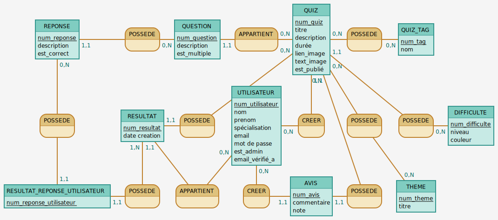
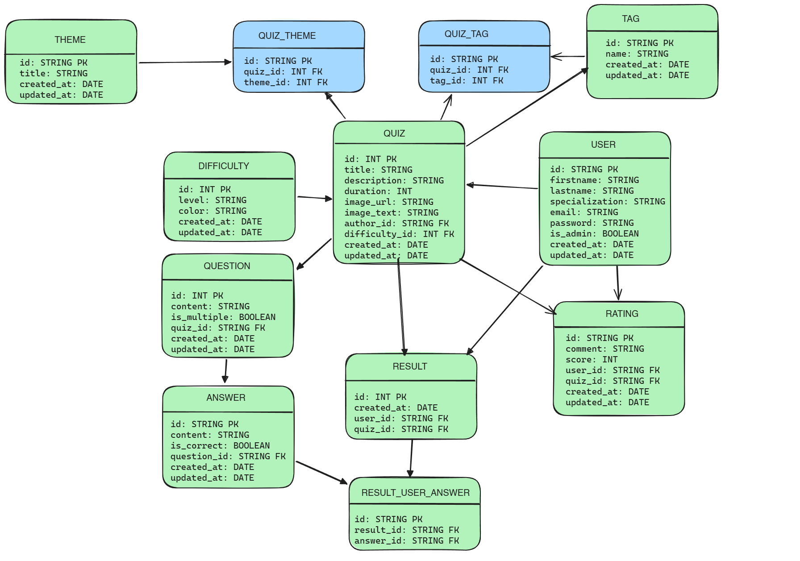

# Conception MCD-MLD

## MCD



## MLD



### script Mocodo

```
REPONSE: num_reponse, description, est_correct
POSSEDE2, 0N QUESTION, 11 REPONSE
QUESTION: num_question, description, est_multiple
APPARTIENT, 0N QUIZ, 11 QUESTION
QUIZ: num_quiz, titre, description, durée, lien_image, text_image, est_publié
POSSEDE9, 0N QUIZ, 0N QUIZ_TAG
QUIZ_TAG: num_tag, nom
:

POSSEDE8, 0N REPONSE, 11 RESULTAT_REPONSE_UTILISATEUR
RESULTAT: num_resultat, date creation
POSSEDE5, 0N QUIZ, 11 RESULTAT
UTILISATEUR: num_utilisateur, nom, prenom, spécialisation, email, mot de passe, est_admin, email_vérifié_a
CREER, 11 QUIZ, 0N UTILISATEUR
POSSEDE, 0N QUIZ, 0N THEME
POSSEDE3, 11 QUIZ, 0N DIFFICULTE
DIFFICULTE: num_difficulte, niveau, couleur

RESULTAT_REPONSE_UTILISATEUR: num_reponse_utilisateur
POSSEDE6, 1N RESULTAT, 11 RESULTAT_REPONSE_UTILISATEUR
APPARTIENT2, 0N UTILISATEUR,  11 RESULTAT
CREER2, 11 AVIS, 0N UTILISATEUR
AVIS: num_avis, commentaire, note
POSSEDE1, 11 AVIS, 0N QUIZ
THEME: num_theme, titre
:


```
